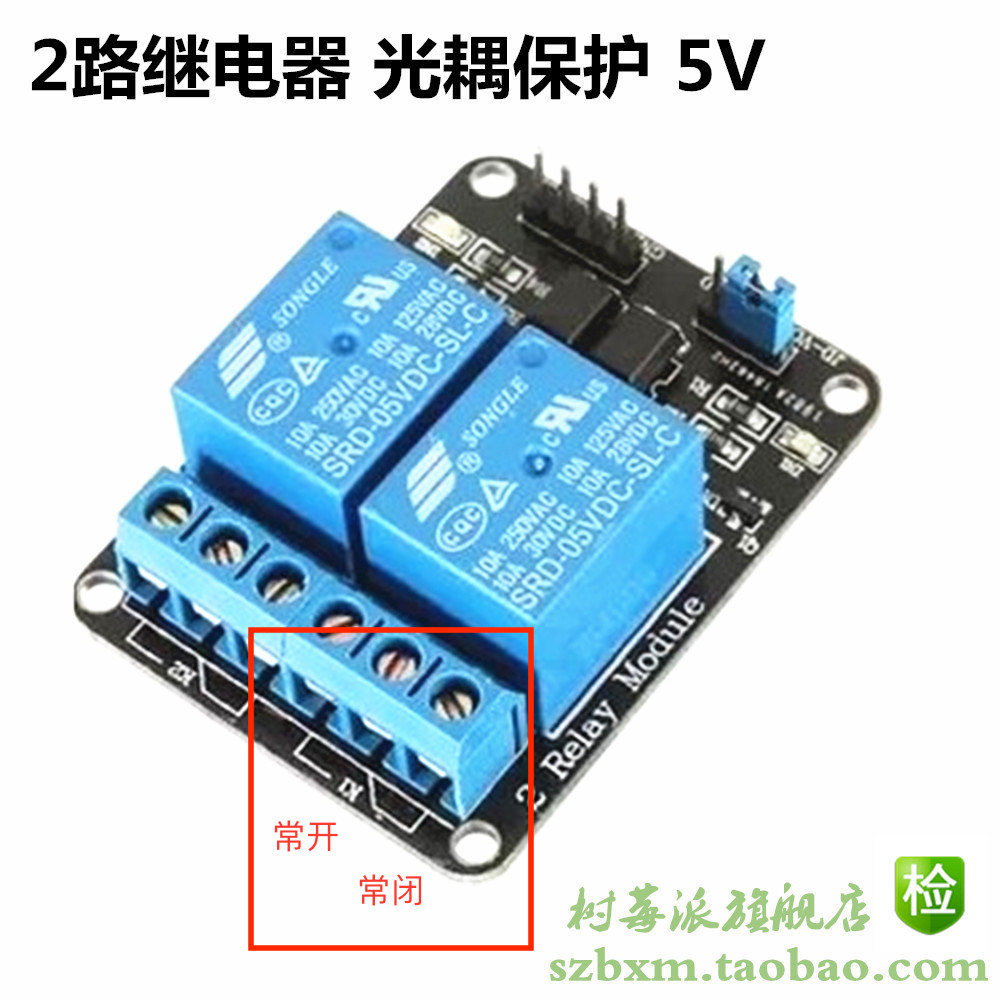
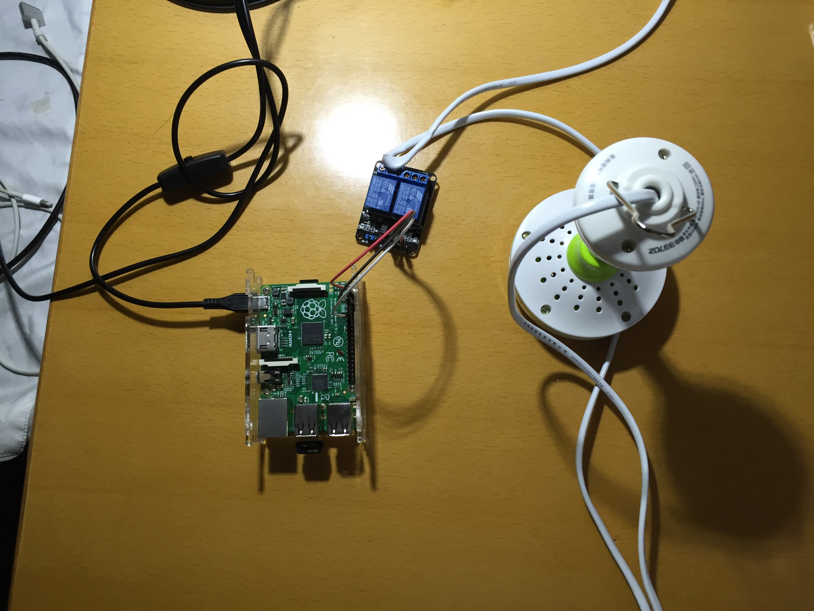

# 懒人必备
天气炎热起来了，怕家里小朋友被蚊子咬就盖了个蚊帐，怕小朋友晚上睡觉热就在某宝买了个20多元的小吊扇挂在蚊帐里
怕小朋友去拖拉小电扇的电线就沿着帐顶布线，结果是开关电扇巨麻烦，站起来还要留个心，别被扇了。

想到压箱底的RaspberryPi，拿出来准备控制一下小电扇还是可以的。

[RaspberryPi的Pinout说明](Raspberry-Pi-v2-Mod-B-Pinout.pdf)

使用Rpi的Pin11作为信号输出，连接到继电器的IN1。将Rpi的5V和GND连接到继电器的VCC和GND。
把小电扇的开关盒子拆解掉后，用烙铁将焊接在铜片上的电线融掉拿下。
把刚才的断头电线的两头接入继电器K1的常闭开关里。

最后写点python代码就可以控制小电扇开关了。
